# Hanwoo Grade Prediction with Weather and Livestock Data

Public portfolio release for a 5th-place machine-learning competition project:
farm-aware validation, weather exposure, lineage genetics, and fold-safe proxy
carcass traits for Hanwoo grade prediction.

This repository contains the final v13 pipeline for predicting Hanwoo (`한우`, Korean native cattle) carcass grade (`도체등급`) from livestock, weather, farm, lineage, and KPN genetic data.

The final runnable model is:

```text
pipeline_v13_model.py
```

The prediction target is `LAST_GRADE`, a 16-class final grade (`최종등급`) label:

```text
1++A, 1++B, 1++C,
1+A,  1+B,  1+C,
1A,   1B,   1C,
2A,   2B,   2C,
3A,   3B,   3C,
등외
```

`등외` is translated in this project as `out-of-grade`.

<p align="center">
  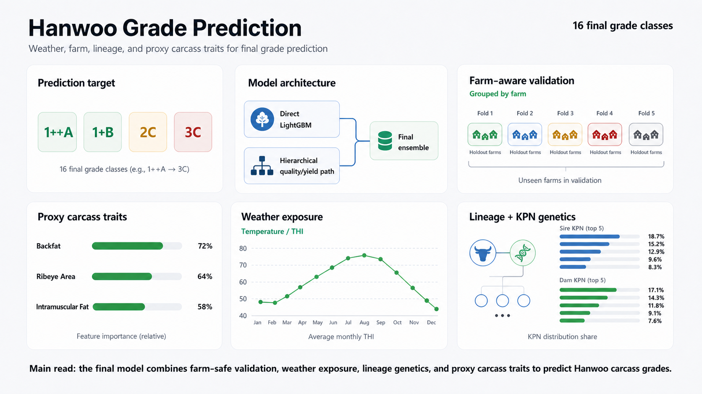
</p>

The final model combines farm-safe validation, weather exposure, lineage
genetics, and proxy carcass traits to predict Hanwoo carcass grades.

## Competition

Built for the [KMA Weather Big Data Contest](https://bd.kma.go.kr/contest/main.do)
livestock topic (`날씨 빅데이터 대회 축산 주제 입선`), predicting Hanwoo carcass
grade from weather exposure combined with livestock, farm, lineage, and KPN
genetic data.

| | |
|:---|:---|
| Result | 5th place / 입선 |
| Task | Weather-data-based Hanwoo carcass grade prediction |
| Period | 2026.05-2026.07 |

## Repository Structure

| Path | Description |
|:---|:---|
| `pipeline_v13_model.py` | final v13 model pipeline |
| `hanwoo_eda.ipynb` | reproducible EDA notebook |
| `PIPELINE.md` | detailed technical explanation of the v13 architecture and development history |
| `requirements.txt` | Python dependencies for the final model and EDA notebook |

Large data files, generated model artifacts, run outputs, and archived experiments are intentionally excluded through `.gitignore`.

## Domain Vocabulary

Some English terms are paired with Korean dataset terms because the raw files use Korean grading concepts.

| English term | Korean term | Meaning |
|:---|:---|:---|
| Hanwoo | 한우 | Korean native cattle |
| carcass grade | 도체등급 | slaughter grading outcome |
| final grade | 최종등급 | `LAST_GRADE`, the 16-class prediction target |
| quality grade | 육질등급 | meat quality grade: `1++`, `1+`, `1`, `2`, `3`, `등외` |
| yield grade | 육량등급 | carcass yield grade: `A`, `B`, `C` |
| out-of-grade | 등외 | outside the normal quality-grade classes |
| carcass traits | 도체형질 | measured slaughter traits such as backfat, ribeye area, intramuscular fat, color, texture, and maturity |
| lineage | 혈통 | parent/grandparent and KPN identity information |
| weather exposure | 기상 노출량 | accumulated weather conditions before slaughter |
| KPN genetic data | KPN 유전능력 자료 | KPN breeding-value and accuracy features |

## EDA Findings

The EDA explains why the final v13 pipeline is structured as a farm-aware, proxy-assisted ensemble rather than a simple direct classifier.

- Train and test farms do not overlap, so random row validation is too optimistic. Validation must group cattle by farm.
- The target is imbalanced. Rare labels such as `3C`, out-of-grade (`등외`), and yield grade C (`육량등급 C`) strongly affect Macro F1.
- Measured carcass traits (`도체형질`) are highly predictive of grade, especially `BACKFAT`, `REA`, `INSFAT`, texture, and maturity. However, these measured traits are missing from the test set.
- Sex and judge-sex composition shift quality-grade (`육질등급`) distributions, so sex-related categorical features are retained.
- Weather is modeled as accumulated pre-slaughter exposure (`기상 노출량`), using rolling heat, temperature, and THI summaries before slaughter.
- Farm context, weather station, lineage (`혈통`), and KPN genetic data (`KPN 유전능력 자료`) provide supporting signal, but they do not fully replace missing carcass-trait information.

The EDA notebook, `hanwoo_eda.ipynb`, contains the reproducible analysis behind these conclusions, including grade imbalance, carcass-trait relationships, sex effects, train/test drift, missingness, weather exposure, farm context, lineage coverage, and KPN signal checks.

<p align="center">
  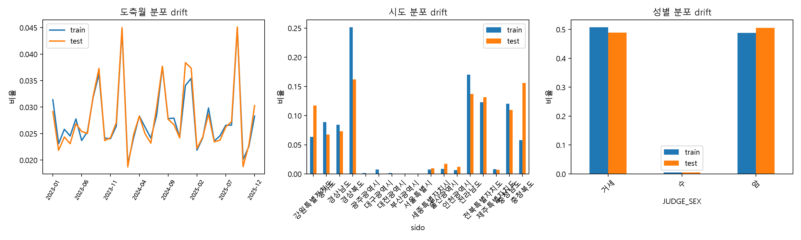
</p>

Farm-grouped validation is necessary because a random row split would let
farm-level context leak across folds.

<p align="center">
  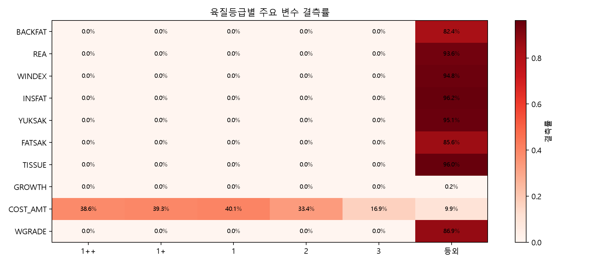
</p>

The missing measured carcass traits are the motivation for Nested Proxy
Reconstruction in the final v13 model.

<p align="center">
  
</p>

Sex-related categorical features remain in the model because the grade
distribution changes materially by sex and judge-sex composition.

<p align="center">
  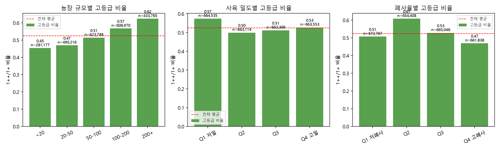
</p>

Farm context provides supporting signal, but it does not replace the missing
carcass-trait measurements on its own.

<p align="center">
  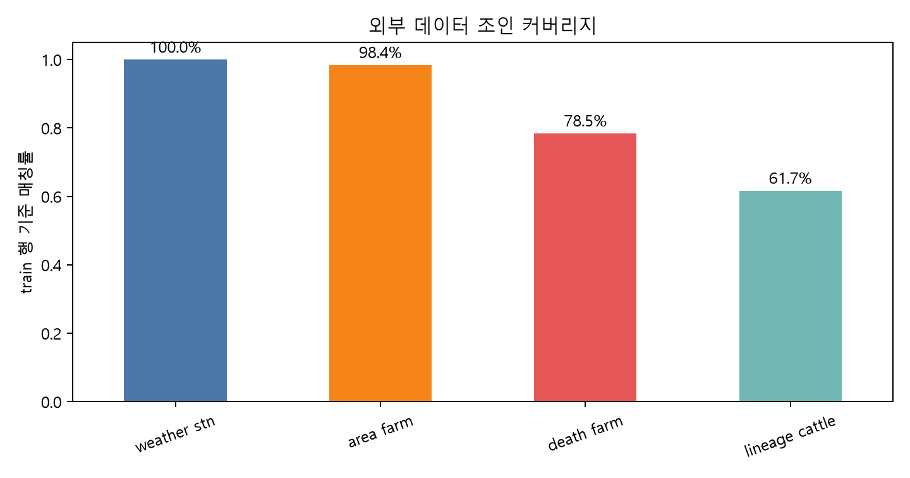
</p>

<p align="center">
  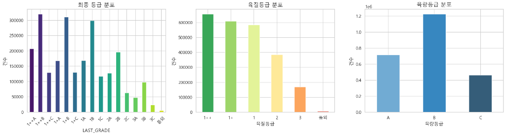
</p>

<p align="center">
  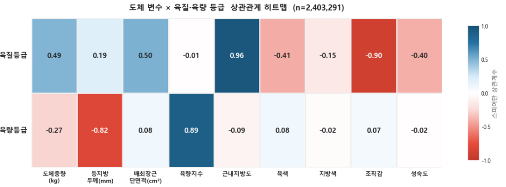
</p>

<p align="center">
  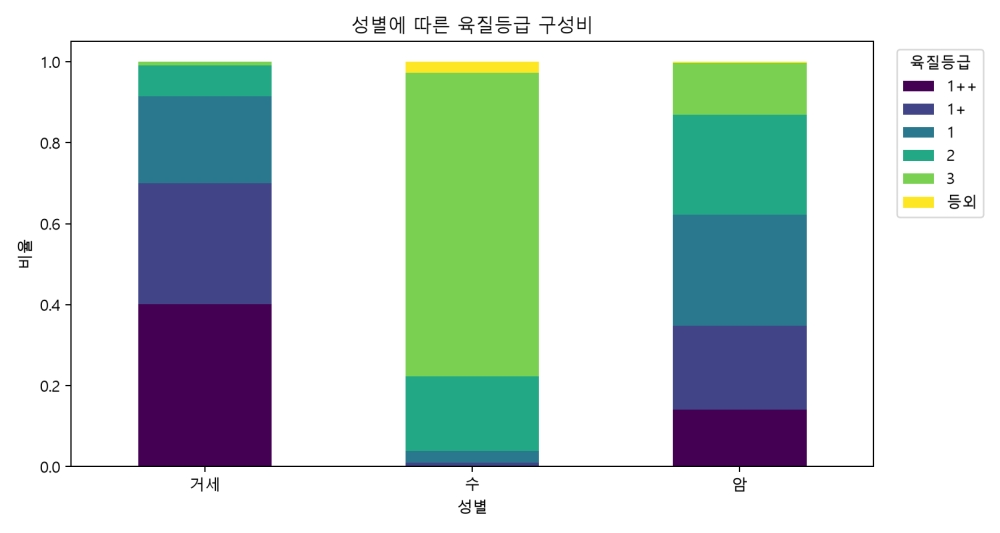
</p>

<details>
<summary>KPN genetic-data checks (6 charts)</summary>

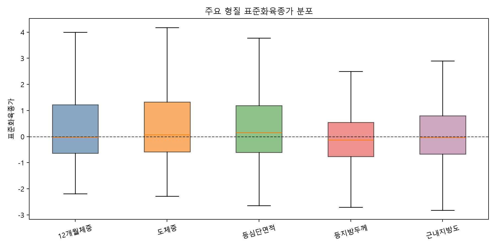
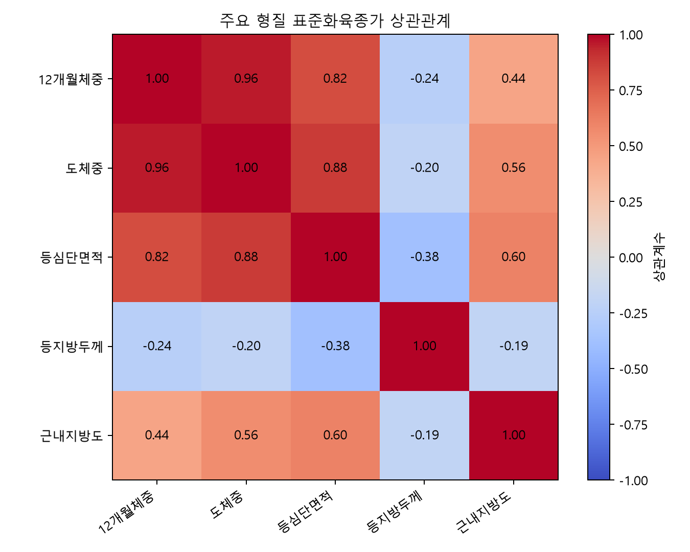
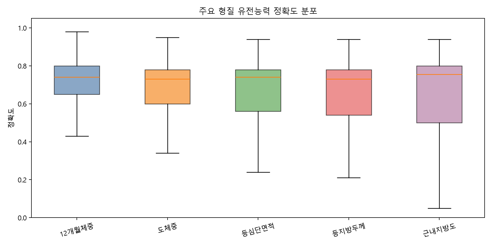
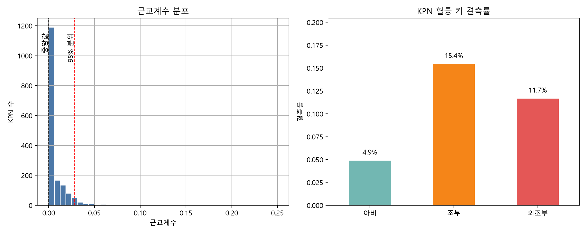
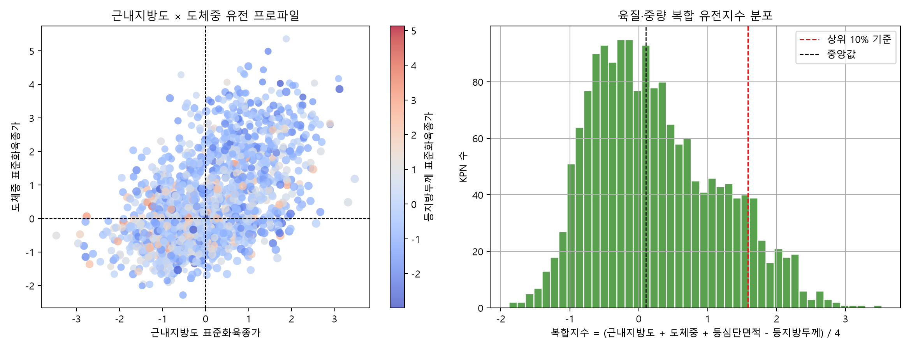
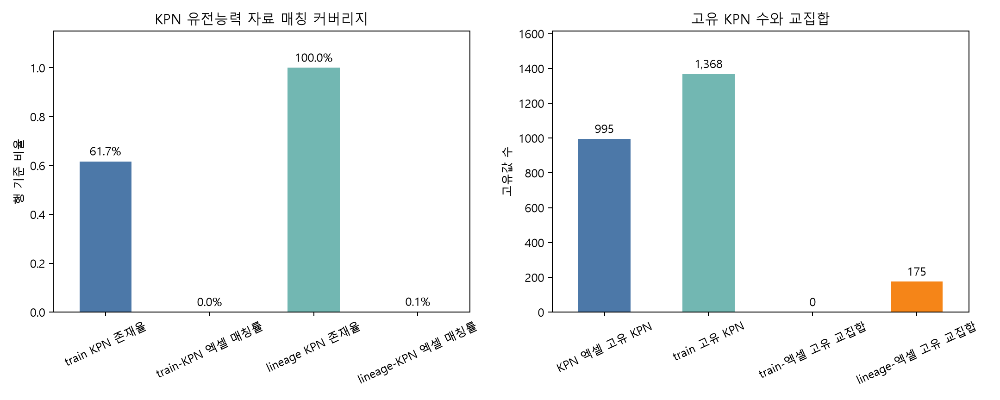

</details>

## Final v13 Model

The final model combines a direct final-grade model with a hierarchical quality/yield model.

| Component | Role |
|:---|:---|
| Farm-aware validation | uses `StratifiedGroupKFold` so each farm appears in only one fold |
| Nested Proxy Reconstruction | estimates test-missing carcass traits as fold-safe `proxy_*` features |
| Direct LightGBM path | predicts the 16 final classes directly |
| CatBoost quality path | predicts quality grade (`육질등급`) using categorical and lineage-heavy features |
| Ordinal LightGBM quality path | models the ordered structure of quality grades |
| Dual-C XGBoost yield path | predicts yield grade (`육량등급`) with additional handling for class C |
| Final blending/calibration | combines direct and hierarchical probabilities and adjusts rare-class probabilities |

The most important v13 addition is Nested Proxy Reconstruction. Because the test set does not include measured carcass traits, v13 trains fold-safe proxy models to estimate backfat, ribeye area, intramuscular fat, meat color, fat color, texture, maturity, and rule-derived yield/quality signals. These proxy features let the final classifier use the information pattern of carcass traits without leaking training-only measured values into test-time inference.

The hierarchical path reflects the grading system itself: most final labels combine a quality grade (`육질등급`) and a yield grade (`육량등급`). This structure improved Macro F1 compared with using only a single direct 16-class classifier.

Performance summary:

| Path | OOF Macro F1 | External validation |
|:---|---:|---:|
| Direct LightGBM | 0.2126 | - |
| Hierarchical path | 0.2384 | - |
| Final ensemble | 0.2475-0.2477 | 0.244 |

For the full model discussion, including development history and component tradeoffs, see [PIPELINE.md](PIPELINE.md).

## Data

The raw competition datasets are not included in this repository. They must be
obtained through the official competition or data-provider channels.

The model was trained with locally available competition data and joined
external/public data sources, including:

- livestock records
- weather exposure data
- farm and location context
- lineage information
- KPN genetic information
- slaughter and carcass measurements available in the training data

The prediction target is `LAST_GRADE`, the final Hanwoo carcass grade. The
pipeline expects the required CSV/Excel files under a local `data/` directory,
which is intentionally ignored by Git.

Expected local files:

| File | Purpose |
|:---|:---|
| `data/hanwoo_train.csv` | training rows with final grades and measured carcass traits |
| `data/test_hanwoo.csv` | test rows to predict |
| `data/hanwoo_lineage_0612.csv` or `data/hanwoo_lineage.csv` | lineage (`혈통`) and KPN mapping |
| `data/hanwoo_weather.csv` | station-level daily weather |
| `data/hanwoo_area.csv` | farm area and yearly herd counts |
| `data/hanwoo_death.csv` | death-history records |
| `data/KPN 유전능력 자료.xlsx` | optional KPN genetic breeding-value supplement |

Required for a full v13 run:

- `hanwoo_train.csv`
- `test_hanwoo.csv`
- one lineage file: `hanwoo_lineage_0612.csv` preferred, otherwise `hanwoo_lineage.csv`

Optional files are used when present to enrich features.

## Installation

Python 3.11 is recommended.

Create and activate an environment:

```bash
python -m venv .venv
```

Windows PowerShell:

```powershell
.\.venv\Scripts\Activate.ps1
```

macOS/Linux:

```bash
source .venv/bin/activate
```

Install dependencies:

```bash
pip install -r requirements.txt
```

The dependency list is intentionally aligned with [requirements.txt](requirements.txt):

```text
numpy>=1.26,<2.0
pandas>=2.0
python-dateutil>=2.8
scikit-learn>=1.4
lightgbm>=4.0
catboost>=1.2
xgboost>=2.0
matplotlib>=3.8
seaborn>=0.13
jupyterlab>=4.0
notebook>=7.0
ipykernel>=6.0
```

`numpy` is capped below 2.0 to avoid binary compatibility issues with gradient boosting libraries in some environments. The model reads KPN `.xlsx` data directly through ZIP/XML parsing, so `openpyxl` is not required.

## Running the Final Pipeline

From the repository root:

```bash
python pipeline_v13_model.py
```

Default output directory:

```text
outputs/v13/
```

Main outputs include prediction results, component metrics, proxy reconstruction metrics, calibration results, class-level OOF metrics, and feature importance.

## Runtime Options

The competition model was developed and tuned with GPU acceleration. This
public release now defaults to CPU for portability and reproducibility on a
fresh clone. Use GPU acceleration when your local CatBoost/XGBoost environment
supports it:

```bash
CATBOOST_TASK_TYPE=GPU XGBOOST_DEVICE=cuda python pipeline_v13_model.py
```

Windows PowerShell:

```powershell
$env:CATBOOST_TASK_TYPE="GPU"
$env:XGBOOST_DEVICE="cuda"
python pipeline_v13_model.py
```

Run lightweight checks:

```bash
PIPELINE_SMOKE_STAGE=config python pipeline_v13_model.py
PIPELINE_SMOKE_STAGE=setup python pipeline_v13_model.py
```

Windows PowerShell:

```powershell
$env:PIPELINE_SMOKE_STAGE="config"
python pipeline_v13_model.py
```

## Running the EDA Notebook

```bash
jupyter notebook hanwoo_eda.ipynb
```

or:

```bash
jupyter lab
```

## Notes

- Large data files are intentionally ignored. Use Git LFS or external storage if you need to publish data.
- Archived experiments and old scripts are excluded from the public repo surface; the final implementation is self-contained in `pipeline_v13_model.py`.
- Before recreating or publishing the GitHub repository, follow the private clean-history checklist in [docs/CLEAN_HISTORY_RELEASE.md](docs/CLEAN_HISTORY_RELEASE.md).

## License

Code in this repository is released under the MIT License.

The underlying livestock, weather, and KPN datasets are not included and are
not covered by this license. They were provided under the competition and data
provider terms and remain the property of their respective providers. Obtain
them through official channels; do not redistribute.
